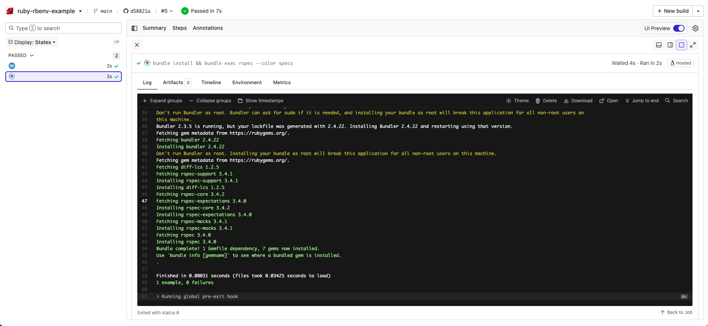

# Buildkite Ruby rbenv Pipeline Example

This repository is an example on how to test a [Ruby](https://www.ruby-lang.org/en/) project using [Buildkite](https://buildkite.com/) and [rbenv](https://github.com/rbenv/rbenv). 

See the full [Getting Started Guide](https://buildkite.com/docs/guides/getting-started) for step-by-step instructions on how to get this running, or [Add to Buildkite](https://buildkite.com/new) to try it yourself.

## How does it work?

It uses a local agent environment hook in [.buildkite/hooks/pre-command](.buildkite/hooks/pre-command) to setup rbenv.

See the [agent hook documentation](https://buildkite.com/docs/agent/hooks) for more information on how agent hooks work.

## License

See [Licence.md](Licence.md) (MIT)
